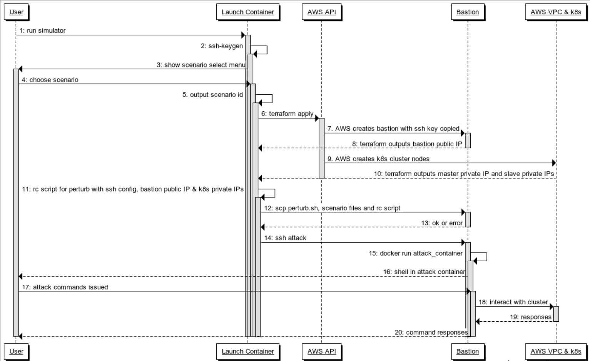

# Standalone simulator

A distributed systems and infrastructure simulator for attacking and debugging Kubernetes

## Sequence Diagram



- **User** - the end user who is operating the standalone Simulator CLI tool in order to create a cluster with a running scenario
- **Launch Container** - a Docker container image in which the simulator tooling runs (Terraform, and triggering the perturb scripts); this runs in a container to encpasulte dependencies for portability
- **AWS API** - Terraform interacts with AWS APIs in order to create a VPC and EC2 instances for the bastion host and Kubernetes cluster
- **Bastion** - EC2 instance in the same VPC as the Kubernetes cluster from which the perturb scripts are run. The launch container will first generate an SSH key that can be used by Terraform to access the bastion
- **AWS VPC & k8s** - VPC in which the Bastion and k8s cluster nodes sit
- **RC script** - like a .env file, with values coming back from Terraform that are needed by the perturb script
- **Attack container** - a container run on the Bastion after perturb in order to give the user a shell on the Bastion, but inside a container, with tools specific to either the cloud provider or the scenario

## Appendix - Sequence Diagram Source

```
User->Launch Container: 1: run simulator
activate Launch Container
Launch Container->Launch Container: 2: ssh-keygen
activate Launch Container
Launch Container->User: 3: show scenario select menu
activate User
User->Launch Container: 4: choose scenario
activate Launch Container
Launch Container->Launch Container: 5. output scenario id
activate Launch Container
Launch Container->AWS API: 6: terraform apply
activate AWS API
AWS API-> Bastion: 7. AWS creates bastion with ssh key copied
activate Bastion
Bastion-->Launch Container: 8: terraform outputs bastion public IP
deactivate Bastion
AWS API->AWS VPC & k8s: 9. AWS creates k8s cluster nodes
AWS VPC & k8s-->Launch Container: 10: terraform outputs master private IP and slave private IPs
deactivate AWS API
Launch Container->Launch Container: 11: rc script for perturb with ssh config, bastion public IP & k8s private IPs
activate Launch Container
Launch Container->Bastion: 12: scp perturb.sh, scenario files and rc script
activate Bastion
Bastion-->Launch Container: 13: ok or error
deactivate Bastion
Launch Container->Bastion: 14: ssh attack
activate Bastion
Bastion->Bastion: 15: docker run attack_container
activate Bastion
Bastion-->User: 16: shell in attack container
User->Bastion: 17: attack commands issued
activate Bastion
Bastion->AWS VPC & k8s: 18: interact with cluster
activate AWS VPC & k8s
AWS VPC & k8s-->Bastion: 19: responses
deactivate AWS VPC & k8s
Bastion-->User: 20: command responses
deactivate Bastion
deactivate Bastion
deactivate Bastion
deactivate Launch Container
deactivate Launch Container
deactivate Launch Container
deactivate Launch Container
deactivate Launch Container
deactivate User
```
