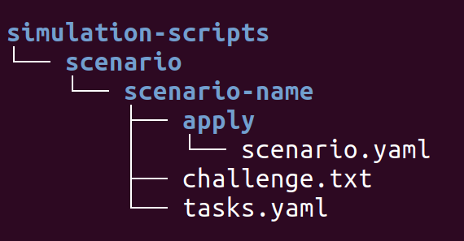

# Creating a Simulator Scenario

The following is a guide on contributing scenarios in terms of what they should contain from a technical and functional standpoint.

## Before you start

Ensure that your scenario does not already exist in [the list of scenarios](../simulation-scripts/scenario/). You can read all the challenge texts and hints in each scenario's directory. Familiarise yourself with the structure.

## Creating scenarios

### How to add a scenario

In simulation-scripts > scenario create the following structure of folder

- _scenario name_: Substitute "scenario-name" with the name of your scenario.
- _apply folder_: Any yaml you put in the "apply" folder will get applied at scenario launch. This could be misconfigured RBAC, deployment, secret or any other kubernetes resource.
- _challenge.txt_: Anything you put in "challenge.txt" will get displayed on entering the scenario as the challenge text to the user. Put any context and information on tasks you want in here. You should format it with the overall challenge, and then bullet point the tasks you want available to the user.
- _tasks.yaml_: "tasks.yaml" is where you store the hints for your tasks - for example an attack and a mitigation task. Hints in this file are displayed in order on prompt from the user as part of the exercise.
- _other scripts_: At the root of the scenario directory you can also add optional scripts which will run on either workers or masters when you launch the scenario. These, could, for example edit or create files on the host or change user permissions. See your options for scripts [here](./scenario.md)

When you are done writing your scenario, you must put it in the [scenario yaml ](../simulation-scripts/scenarios.yaml). The scenarios in here will be launchable from the launch container on running the simulator.

### What a good scenario contains

A good scenario should be focused on one or two related vulnerabilities or misconfigurations. Some examples of current scenarios include:

_Resource definitions_
- secrets in environment variables
- missing pod security policies
- missing network definitions
- overly permissable service accounts

_Core Components_
- misconfigured ports on the kubelet
- no authorization on the kubernetes API
- authentication-less etcd

Additionally there should be a structured story to your scenario. Most of the scenarios include an attack task from for example a pod/container or external server and a mitigation task to fix the misconfiguration. Don't forget to provide all necessary information to the user in the challenge.txt file - if the user needs to attack a port on the node, they will need to be aware of the node IP from the start.

## Testing
